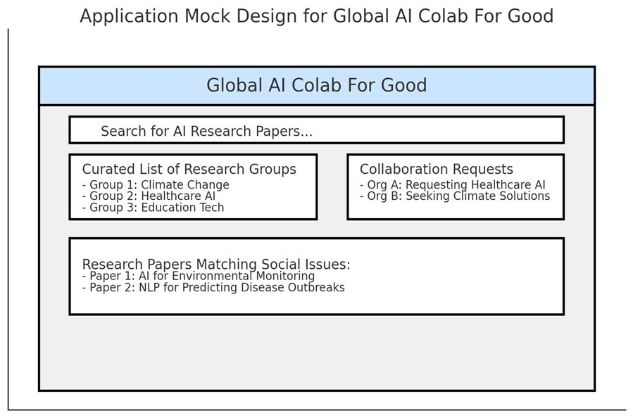
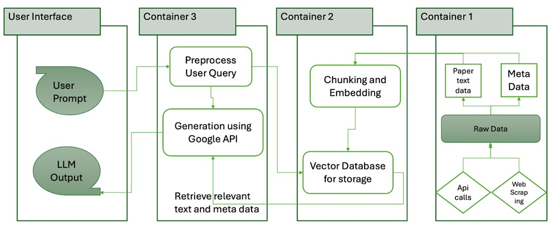

**Group Name:** AI Research For Good

**Project:** Build a global platform that links AI research groups with organizations aiming to solve social issues using AI. The platform will have a search interface for organizations to look for AI research papers relevant to their social cause. A dashboard will provide a curated list of relevant research to the user prompt, the research groups, and how the research work relates to the user’s problem prompt. The platform will be designed to support a growing number of research groups and global organizations. We process a large corpus of AI research papers & social issue descriptions and train LLMs for information retrieval and matching between research and real-world problems.

The User Interface is as shown:




The Pipeline Flow is as shown:



## Data Pipeline Overview

We utilized textual data fetched from social impact-related papers obtained using the ArXiv API, then embedded it using the Hugging Face library and stored it in the vector database. Currently, we fetch and store the manuscripts (both raw and embedded) for around 30 papers.

**Container 1: Retrieve Papers**

Query ArXiv API for papers on “social impact” fetch metadata for the top 30 results and save all the manuscript .txt files to the Google cloud bucket.

Instructions for running the container:
```
cd retrieve_papers
pipenv lock
docker build -t retrieve_papers .
docker run --rm -ti -v "$(pwd)":/app retrieve_papers
python retrieve_papers.py
```

**Container 2: Embedding Papers**

Process the manuscripts, perform chunking, embed each chunk and store the embeddings in a ChromaDB vector database

Instructions for running the container:
```
cd embed_papers
pipenv lock
docker build -t embed_papers .
docker run --rm -ti -v "$(pwd)":/app embed_papers
python embed_papers.py
```

**Container 3: RAG**

Manages the retrieval of relevant research papers and generates responses for user queries using Gemini MiniLM

Instructions for running the container:
```
cd perform_rag
pipenv lock
docker build -t perform_rag .
docker run --rm -ti -v "$(pwd)":/app perform_rag
python perform_rag.py
```
**Setup instructions and usage guidelines for the API to communicate between the front end and back end**

1. Navigate to ```api-service``` directory
2. Build & Run Container
```sh docker-shell.sh```
3. Run the following command within the docker shell:
```uvicorn_server```
4. Verify service is running at http://localhost:9000
5. Go to http://localhost:9000/docs to test the API from this tool by giving in the query
6. Navigate to the ```frontend_ui``` directory
7. Build & Run the container:
```sh docker-shell.sh```
8. Run frontend application
```streamlit run app.py```

**Modifications for Milestone 4**
1. Implemented GitHub Actions with linting, automated testing, and >50% coverage across all modules.
2. Built a Streamlit-based frontend interface for user interaction and result visualization.
3. Developed FastAPI endpoints for user queries to communicate between the front end and back end.
5. Integrated fine-tuned LLM outputs for relevance filtering and response generation.
