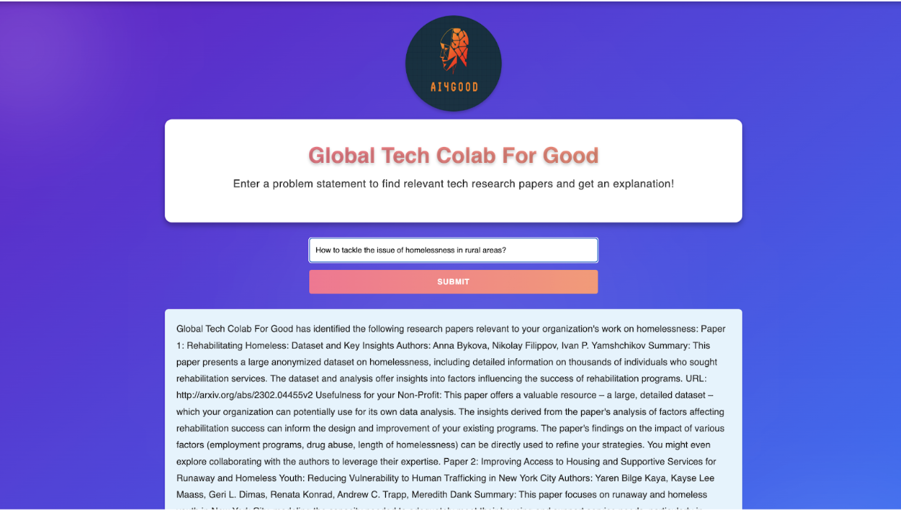

**Group Name:** AI Research For Good

**Project:** Build a global platform that links AI research groups with organizations aiming to solve social issues using AI. The platform has a search interface for organizations to look for AI research papers relevant to their social cause. A dashboard provides a curated list of relevant research to the user prompt, the authors, and how the research work relates to the user’s problem prompt. The goal is to support a growing number of research groups and global organizations. We process a large corpus of AI research papers & social issue descriptions and train LLMs for information retrieval and matching between research and real-world problems for social good.

The User Interface is as shown:




The Pipeline Flow is as shown:


## Data Pipeline Overview

We utilized textual data fetched from social impact-related papers obtained using the ArXiv API, then embedded it using the Hugging Face library and stored it in the vector database. Currently, we fetch and store the manuscripts (both raw and embedded) for around 30 papers.

**Container 1: Retrieve Papers**

Query ArXiv API for papers and fetch metadata for the top 30 results and save all the manuscript .txt and metadata files to the Google cloud bucket.

Instructions for running the container:
```
cd retrieve_papers
pipenv lock
docker build -t retrieve_papers .
docker run --rm -ti -v "$(pwd)":/app retrieve_papers
python retrieve_papers.py
```

**Container 2: Embedding Papers**

Process the manuscripts, perform chunking, embed each chunk and store the embeddings in a ChromaDB vector database

Instructions for running the container:
```
cd embed_papers
pipenv lock
docker build -t embed_papers .
docker run --rm -ti -v "$(pwd)":/app embed_papers
python embed_papers.py
```

**Container 3: RAG**

Manages the retrieval of relevant research papers, performs further filtering using a fine-tuned relevance rating Gemini-1.5-Flash model, and generates responses for the end user using Gemini-1.5-Pro.

Instructions for running the container:
```
cd perform_rag
pipenv lock
docker build -t perform_rag .
docker run --rm -ti -v "$(pwd)":/app perform_rag
python perform_rag.py
```
## Instructions for deployment#

These instructions assume you have set up SSH and have the keys `/secrets/deployment.json`, `/secrets/gcp-service.json`, `/secrets/ssh-key-deployment`, and `/secrets/ssh-key-deployment.pub` already set up. If not, please request access to our GCP project and follow the SSH setup instructions [here](https://github.com/dlops-io/cheese-app-v3/tree/main?tab=readme-ov-file#ssh-setup).

Then, run the following commands in your terminal within the root directory of this repository: 
1. `cd src/deployment` 
2. `sh docker-shell.sh` 
3. `ansible-playbook deploy-docker-images.yml -i inventory.yml` 
4. `ansible-playbook deploy-k8s-cluster.yml -i inventory.yml --extra-vars cluster_state=present`
5. Copy the and `nginx_ingress_ip` and go to `http://<YOUR INGRESS IP>.sslip.io` 

## Modifications for Milestone 5
1. Deployed our application on GCP Virtual Machine (VM).
2. Added the React frontend.
3. Generated synthetic data and fine-tuned the model again with increased training samples.
4. Increased all test coverage to 70%.

## Project Milestone 5 Organization

```
├── .github/
│   └── workflows/
│       └── pre-commit.yml          # GitHub Actions workflow for pre-commit hooks
├── notebooks/
│   ├── .gitkeep                    # Placeholder to keep notebooks folder in version control
│   └── eda.ipynb                   # Exploratory Data Analysis notebook
├── references/
│   ├── .gitkeep                    # Contain images eplaining our solution
│   ├── Flowchart.jpeg              # Project flowchart image
│   └── UI.jpeg                     # User interface design image
├── reports/
│   ├── .gitkeep                    # Placeholder for reports folder
├── src/
     ├── api-service/                # API service module
     ├── api/                        # Main API structure
     │   ├── routers/                # FastAPI router modules
     │   │   └── llm_rag_chat.py
     │   └── utils/                  		# Utility modules for API logic
     │       └── llm_rag_utils.py
         ├── service.py                  	# Main service entry file for FastAPI application
     |── Dockerfile                      		# Dockerfile for API containerization
     ├── Pipfile                        		# Pipfile for Python dependencies (pipenv)
     ├── Pipfile.lock                    		# Lock file for pipenv dependencies
     ├── docker-entrypoint.sh            	# Entrypoint script for Docker container
     ├── docker-shell.sh                 	# Shell script for Docker operations
├── embed_papers/                   	# Scripts for embedding research papers
├── finetuning/                     	# Folder for model finetuning scripts and files
├── frontend_react/                     # Frontend implementation
├── deployment/                       	# Deployment implementation
├── perform_rag/                    	# Folder for RAG (Retrieve and Generate) functionality
├── retrieve_papers/                	# Folder for retrieving research papers
├── docker-compose.sh               	# Script for Docker Compose operations
├── tests/                          		# Testing suite
│   ├── test_embed_papers.py        		        # Unit tests for embedding papers
│   ├── test_integration_embed_retrieve.py           # Integration tests for embedding and retrieval
│   ├── test_perform_rag.py         	   	        # Unit tests for RAG functionality
│   ├── test_retrieve_papers.py     		        # Unit tests for paper retrieval
│   └── test_app.py     			        # System tests
├── .gitignore                     	   # Git ignore file
├── .pre-commit-config.yaml        	# Configuration file for pre-commit hooks
├── LICENSE                         	# License for the project
├── README.md                       	# Project README file
├── pytest.ini                     	# Configuration file for pytest
├── requirements.txt                	# Additional requirements for Python dependencies
└── test_output.tar                 	# Test output archive
```

## Known Issues and Next Steps

- *No NGO/Researcher Registration*  
  - Add user profiles for NGOs to submit problems and researchers to share expertise.

- *Limited Front-End Interactivity*  
  - Enable conversational UI, query suggestions, and paper previews.

- *Simplistic Relevance Scoring*  
  - Use multi-level relevance scoring (e.g., Highly/Moderately/Marginally Relevant).

- *Model Dependency & Hallucinations*  
  - Add confidence metrics and a fact-checking layer.

- *Support for Novel Ideas*  
  - Provide alternative suggestions or partner with think tanks for unique challenges.

- *Paper Collection Updates*  
  - Automate frequent updates via research repository APIs and display update timestamps.

- *Identify Papers with Code*  
  - Add a badge/filter for papers with open-source code and link to repositories.


## Usage details and examples

Our target audience is the nonprofits, social org interested to incorporate tech solutions to scale to impact and researcher, freelance/volunteers interested to help. We have a interface where non-profits can query the problem they are trying to solve. In response, the platform will display top relevant papers, details of the research group, and how these papers can be used to solve the NGO’s queried problem.
Examples:
An LA-based organization that aims to reduce homelessness. We have heard from their other non-profit friends that AI and automation could help tackle their challenges in a more resource and cost-efficient way.  We have a software development volunteer and are interested in using their skills to build a nice, technical solution. But it would be helpful if we had a reference of previous work/success! This is where our platform will be useful!